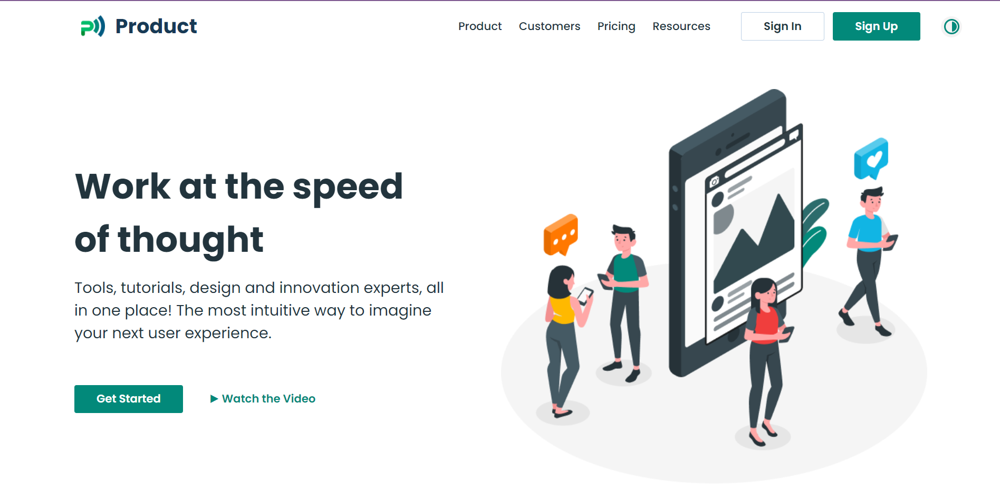
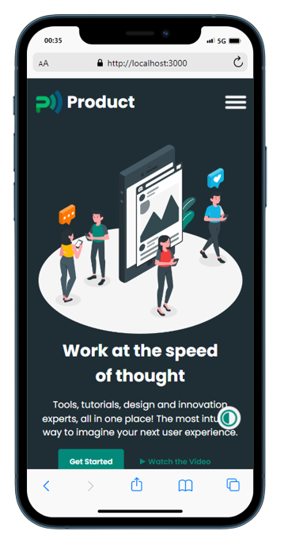

# My Product

Projeto Desenvolvido em React.Js, utilizando Styled-Components e React-Router-DOM!

## O que foi Utilizado:
* React.Js
* React-Router-DOM
* Styled-Components

## O que foi feito:
* Acessibilidade
* Responsividade
* Rotas
* Troca de Themes

## Créditos: @wahidari - Figma
##### Template Base: https://www.figma.com/file/NPT4BhtyiYhZ4xXjzu4fz2/MyProduct-(Community)?node-id=0%3A1&t=VhzW6VSUjLmuoebP-0

#### Deploy: https://products-cs7.netlify.app/

